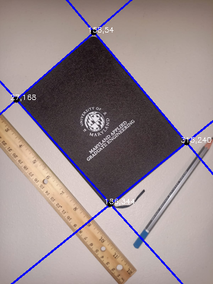

## Perception

## Hough Lines

### Name
- Shantanu Parab

### Student ID
- sparab@umd.edu

## Installation Instructions
- To install numpy, run `pip install numpy` in your terminal.
- To install opencv, run `pip install opencv-python` in your terminal.

## Source Code Files
- [`houghlines.py`](houghlines.py) - This program takes a image and extracts the object (book) to detect its corners..
  + The program will run and output an image.
  + It will show four point coordinates describing the corners of the book.

## How to Run the Program:
To run the program, open the command prompt/terminal and navigate to the directory where the source code files are located. Then, type the following command: python [filename].py.

## Github Link
[Repository](https://github.com/shantanuparabumd/Homography.git)

## Source Image

## Output

